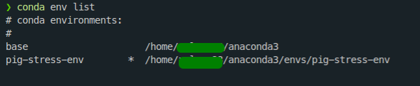

# Never gonna give you up, never gonna let you down:

## Classifying Music Genre using Deep Convolutional Neural Network case study.

This project can be implemented in a variety of ways, but DCNN will be employed. Deep convolutional neural networks (DCNN) are mostly utilized for object identification, picture classification, and recommendation systems, but they are also used for natural language processing on occasion.

## Deep Learning Environment

To get started with deep learning. Follow the steps below

1. install Anaconda Navigator or MiniConda https://www.anaconda.com/products/distribution
2. open anaconda prompt and create an environment
   > conda create -n music-genre python=3.7
3. Check if environment is created

   > conda env list

  

4. Activate the environment
   > conda activate music-genre
5. install dependencies. The dependencies will be used throughout the project specially in deep learning

   > pip install -r requirements.txt

6. Visit the `main.ipynb` file for more information.

Optional commands in the environemnt

- Testing the environemnt if working
  > python test-env.py
- Deactivating environment
  > conda deactivate
- Deleting the environment. Make sure to deactivate the env first.
  > conda env remove --name music-genre
